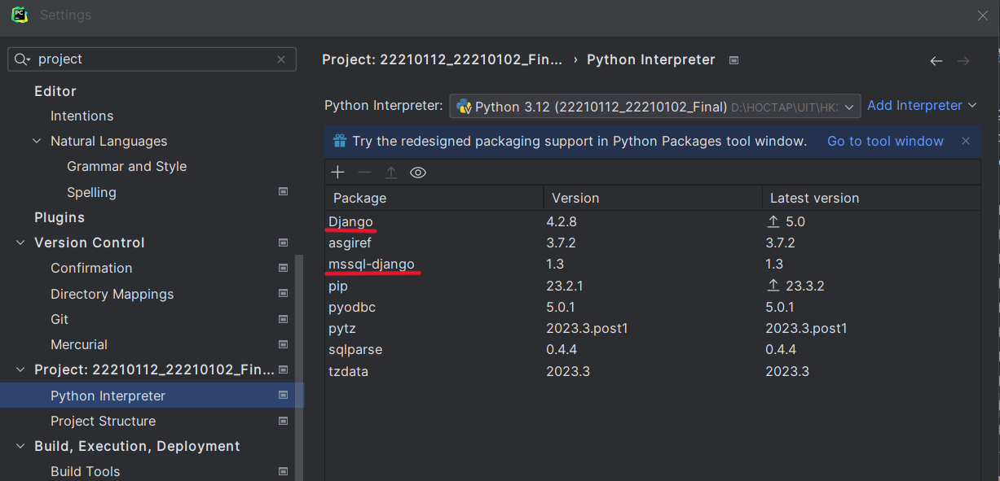

# Ryan Mobile Store

A website of Ryan Mobile, where customer can find and buy cell phones. 

## Getting Started

### Dependencies
- Should run by Pycharm
- Python 3.12
- Microsoft SQL Server
- ODBC Driver 17 for SQL Server
- Django

Note: 
- In MacOS, you may get this error although you already installed ODBC Driver 17 for SQL Server
```
mssql  Can't open lib 'ODBC Driver 17 for SQL Server' : file not found (0) (SQLDriverConnect)")
```
Then you can try to run these command to solve the problem
```
odbcinst -j
sudo ln -s /usr/local/etc/odbcinst.ini /etc/odbcinst.ini
sudo ln -s /usr/local/etc/odbc.ini /etc/odbc.ini
```

- Make sure you have Django and mssql-django package installed. Please check in settings of Pycharm

If not, please install them by click the plus sign (+)

### Execute program
- Create user and database in Microsoft SQL Server like this config. You can change to your local user: 
```
"NAME": "ShoppingDB",
"USER": "sa",
"PASSWORD": "123456",
```

- Run migration
```
python manage.py migrate     
```

- Run app and check at http://127.0.0.1:8000/

- Available user can use to test:
```
mail: test@gmail.com
password: 123
```

### Main features
- List all products in store
- Find products by name
- List popular products (bestseller) in store
- Show product details information
- Show information about the store
- Login/Register user to buy products
- Add products to cart
- Show cart and fill order information to buy products
- Show order histories of user

## Authors
- Trần Quang Duy - 22210112
- Phạm Thị Xuân Chi - 22210102 
